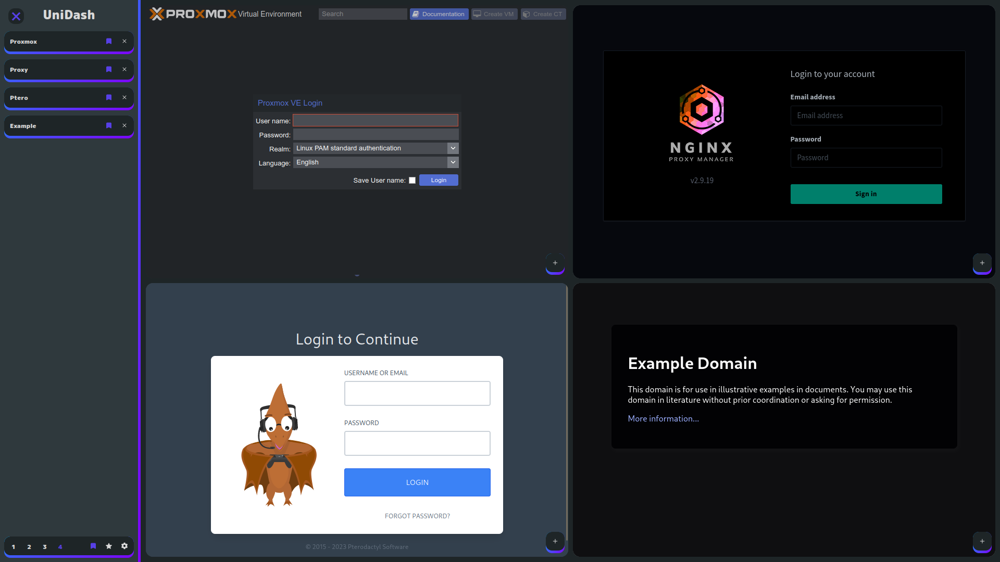

# UniDash

-----

## Licence
Ce projet est sous licence GNU GPL v3.0

[](https://github.com/UniDash-Environement/UniDash/blob/main/LICENSE)

## Auteur
> ## [](https://github.com/Pikatsuto) [Gabriel Guillou](https://github.com/Pikatsuto)

[README_FR 🇫🇷](README_FR.md)

-----

## Screenshots


## Description
UniDash is a universal Dashboard that works with a module integration
using Vue.JS plugins to integrate any kind of functionality.

UniDash is designed to work in conjunction with the UniDash Environment server.
This environment integrates a self-sufficient cluster system on a debian 11 proxmox base.
It is also integrated with UniDash Repo which is a service manager based on ansible.

The UniDash project is currently in its early stages of development
and therefore the project is not yet usable.

## Integration
The integrations planned for this panel are:
- SSH
- SFTP
- FTP
- VNC
- RDP
- VM
- LXC
- Docker
- Réseaux
- Proxy
- DNS

## How to test the progress of the project
### Prerequisites
- NodeJS 18 LTS
- NPM

### Installation and launch
```bash
git clone https://github.com/UniDash-Environement/UniDash.git; cd UniDash
npm i
npm run dev
```
